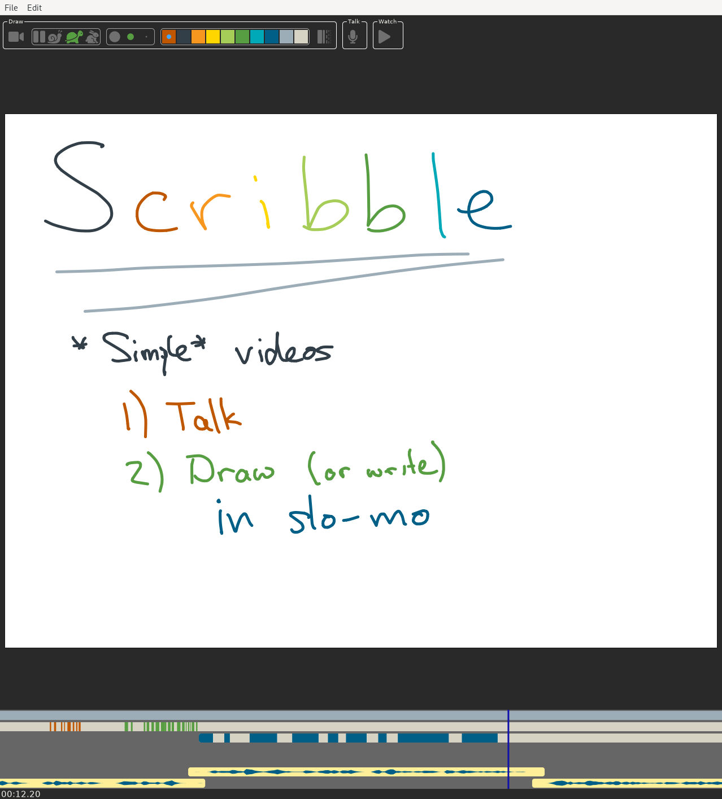

# Scribl: simple instructional videos

Scribl is a program for creating simple instructional videos. There are plenty of fancy programs
out there for making beautiful animations -- this is not one of them. It only aims to be an
improvement (both in terms of output quality and creation effort) over the venerable 
doc-cam + microphone method for creating video lectures.

# A sample

Here's a short video created with scribl:

Here's a screenshot of its user interface:

# This is BETA software.

It is unlikely to work on your computer, particularly if your computer is not
running linux.  If it does run, there is a chance it will crash and eat your
hard work.

# How to run

Because scribl is still beta, in order to run it you will need to compile it yourself.
Scribl is written in the [`rust`](https://www.rust-lang.org) programming language,
so first you'll need to [install a `rust` compiler](https://www.rust-lang.org/tools/install).
Then you'll need to install some dependencies (because although rust manages rust-written dependencies
very easily, scribl also depends on some software written in C). If you're running linux,
you'll need to install (if you don't have them already) development packages for

- GTK+-3
- pango
- gstreamer
- alsa
- atk

You might need install some [`gstreamer`](https://gstreamer.freedesktop.org) plugins (at least `vp9enc` and `webmmux`),
because Scribl uses gstreamer for encoding videos. (If you're on linux, it should be enough
to install a package with a name similar to `gstreamer1.0-plugins-good`.)

Once your rust compiler and gstreamer plugins are ready, you should be able to run Scribl
by cloning this git repository, opening it in a terminal, and typing `cargo run --release`.
